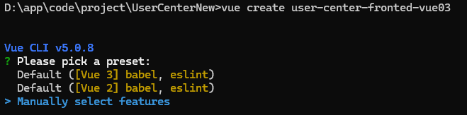

# 用户中心

## Web 前端

Vue3：

Vue-CLI脚手架：快速启动项目

Ant Design组件库：快速开发UI界面

Axios 请求库：

Pinia 状态管理：

前端工程化：ESLint +


### 环境

使用nvm安装node.js

`nvm install 20.18.0`

切换node版本

`nvm use 20.18.0`



### 创建Vue-CLI脚手架
''
```命令行
Vue CLI v5.0.8
? Please pick a preset: Manually select features
? Check the features needed for your project: Babel, TS, Router, Linter
? Choose a version of Vue.js that you want to start the project with 3.x
? Use class-style component syntax? No
? Use Babel alongside TypeScript (required for modern mode, auto-detected polyfills,
transpiling JSX)? Yes
? Use history mode for router? (Requires proper server setup for index fallback in production)
 Yes
? Pick a linter / formatter config: Prettier
? Pick additional lint features: Lint on save
? Where do you prefer placing config for Babel, ESLint, etc.? In dedicated config files
? Save this as a preset for future projects? (y/N) n
```


不要轻易动  项目里的 `node_modules` 文件


Ant Design Vue 4.2.6

[快速上手 - Ant Design Vue](https://antdv.com/docs/vue/getting-started-cn)


layouts

[](https://www.bilibili.com/video/BV1MHSMYvEJq?t=2579.5)


